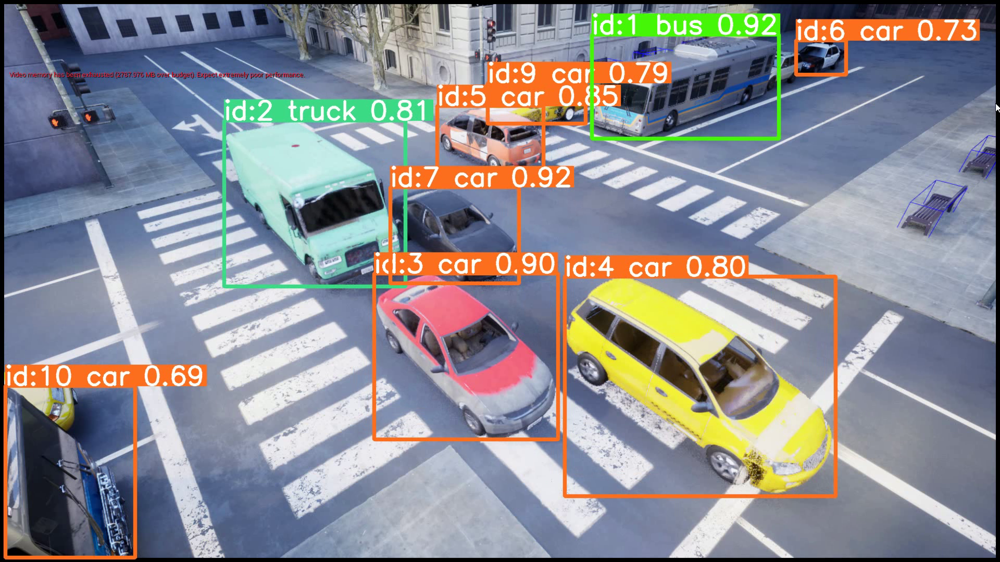

# Využití umělé inteligence a hlubokých neuronových sítí pro vícekamerový sledovací a detekční systém v rizikových úsecích provozu.


<div align="center">
  <p>
  
  </p>
  <br>
  <div>
  <a href="https://starfos.tacr.cz/projekty/CK04000027"></a>

  </div>
</div>


## Úvod

Tento repozitář obsahuje dosažené výsledky v rámci řešení projektu Systém řízENí Dopravy nové gEneRace (SENDER). Cílem projektu je výzkum a vývoj prototypu HW a 2x modulární SW nadstavby (nad multi-kamerovým systémem a světelným signalizačním zařízením včetně dalších senzorů) s obchodním označením Y-SENDER (Systém řízENí Dopravy nové gEneRace) a jeho pilotní ověření v reálném provozu. Systém bude využívat pokročilé prvky umělé inteligence na bázi hloubkových neuronových sítí a dalších pokročilých algoritmů, které v reálném čase umožní sofistikované monitorování a řízení dopravy městských dopravních uzlů včetně inteligentních funkcí pro zvýšení efektivity i bezpečnosti dopravy, zlevní instalační náklady pro nasazení systému, včetně moderních funkcí inteligentní dopravy pro upozornění řidičů na blížící se nebezpečí.

<details>
<summary>Supported object detecting methods</summary>

[YOLOv7](https://github.com/WongKinYiu/yolov7)[](https://arxiv.org/abs/2207.02696) and [YOLOv8](https://github.com/ultralytics/ultralytics)[](). StrongSORT are based on motion + appearance description; ByteTrack are based on motion only.

</details>

<details>
<summary>Supported tracking methods</summary>

[StrongSORT](https://github.com/dyhBUPT/StrongSORT)[](https://arxiv.org/abs/2202.13514) and [ByteTrack](https://github.com/ifzhang/ByteTrack)[](https://arxiv.org/abs/2110.06864). StrongSORT are based on motion + appearance description; ByteTrack are based on motion only.

</details>

## Instalace knihoven

Než začnete s instalací knihoven, je důležité, aby byl ve vašem systému nainstalován Python. Následující kroky vám pomohou s jeho instalací:
[**Python>=3.8**](https://www.python.org/) environment.

Navštivte oficiální stránku Pythonu: https://www.python.org/downloads/.
Vyberte si nejnovější verzi Pythonu vhodnou pro váš operační systém (Windows, MacOS, Linux).
Stáhněte instalační soubor.
Spusťte stažený instalační soubor. Během instalace je důležité zvolit možnost Add Python to PATH, což zajistí, že bude Python správně nastaven v proměnných prostředí vašeho systému.
Následujte instrukce instalačního průvodce. Po dokončení instalace restartujte svůj počítač, pokud je to vyžadováno.
Po restartu otevřete příkazový řádek nebo terminál a zadejte příkaz python --version nebo python3 --version. Měla by se zobrazit verze nainstalovaného Pythonu, čímž ověříte úspěšnou instalaci.

Také se ujistěte, že máte aktuální verzi správce balíčků pip. Aktualizace pipu je možná pomocí příkazu python -m pip install --upgrade pip v příkazovém řádku.

## Instalace navrženého řešení

Tento repozitář obsahuje navržené řešení, respektive aplikaci pro detekci a sledování objektů na definovaných dopravních úsecích.
Aby bylo možné navrženou aplikaci používat, je třeba jako první tvz. naklonovat repozitář do lokálního prostředí. V příkazovém řádku je třeba spustit následující příkaz. 
Tímto příkazem se tedy zkopíruje obsah repozitáře do systému počítače.

```
git clone https://github.com/KicoSVK/yunex_yolo_object_tracking.git
```

Po klonování je třeba přejít do tohoto adresáře:

```
cd yunex_yolo_object_tracking
```

Následně pro instalaci potřebných závislostí spusťte příkaz:
```
git clone https://github.com/mikel-brostrom/yolo_tracking.git
pip install -v -e .
```

Je také třeba nainstalovat modul boxmot, spuštěním příkazu.

```
pip install boxmot
```


## Ukážka možného spustenia:


```bash
$ python examples/track.py --yolo-model yolov8n       # bboxes only
  python examples/track.py --yolo-model yolo_nas_s    # bboxes only
  python examples/track.py --yolo-model yolox_n       # bboxes only
                                        yolov8n-seg   # bboxes + segmentation masks
                                        yolov8n-pose  # bboxes + pose estimation
```


<details>
<summary>Tracking sources</summary>

Tracking can be run on most video formats

```bash
$ python examples/track.py --source 0                               # webcam
                                    img.jpg                         # image
                                    vid.mp4                         # video
                                    path/                           # directory
                                    path/*.jpg                      # glob
                                    'https://youtu.be/Zgi9g1ksQHc'  # YouTube
                                    'rtsp://example.com/media.mp4'  # RTSP, RTMP, HTTP stream
```

</details>


## Contact

For Yolov8 tracking bugs and feature requests please visit [GitHub Issues](https://github.com/mikel-brostrom/Yolov5_StrongSORT_OSNet/issues).
For business inquiries or professional support requests please send an email to: yolov5.deepsort.pytorch@gmail.com
